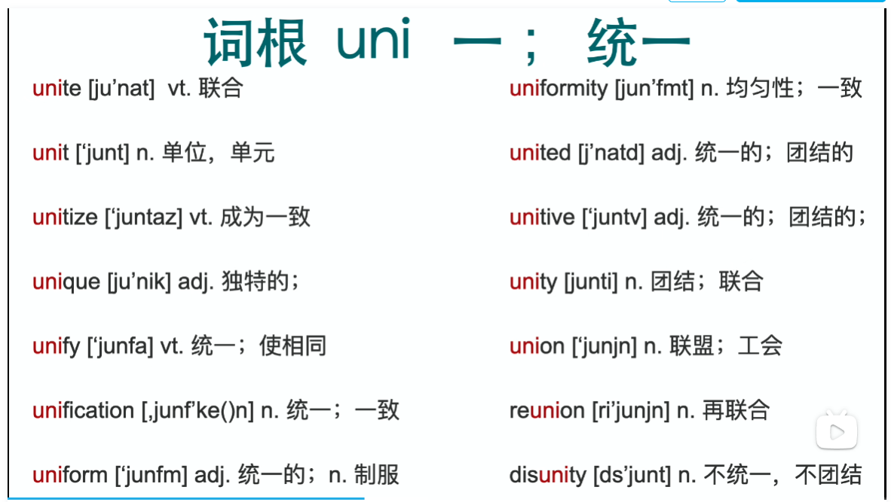

### 词根+词缀  

90%单词是由词根+词缀组成

词缀不表示单词意思，只表示词性；几十个词缀？

词根如何记忆？

---

## **秒记词根**

#### 1 **印欧语音变的核心： 词源不变 语音改变 **  （联想串联记忆--要会破词）

#### 2 口诀：

- **元音a o e i u (w y)	互换**

- **g k (c) h	互换**

- **d t s 	互换**

- **u v w 	互换** 

- **m n l r    互换** 

- **b p m f v  互换**

举例说明：

1. **sim**ul**tane**ously 同时

​		词根 s**i**m = s**a**me 相同

​		词根 t**an**e = t**im**e  a-->i n-->m  时间

2. b**i**g  大   -- >  b**a**g  袋子

#### 3 单数变复数不规则变化 （真的不规则吗？） 

#### 4 不规则动词变化 （真的不规则吗？）

---

#### 5 分类详解

- **元音互换**

  **a = e = i = o = u (= w = y) **

  eg. 词根中应用

  - r**e**st 休息  =   r**u**st  生锈   同源
  - sh**i**rt  衬衫 = sh**o**rt 短的  同源

  - **u**n**i** = **o**n**e**   一；统一

  - **t**r**i** =  **th**r**ee**  三；  t = th   h送气音脱落；i = ee 

    

  

​			

- **u = v = w**

  **字母U和W由V派生出来**

  eg. 

  词根 n***o*v**  =  n***e*w**   新

  词根 **v**ol = **w**ill   自愿	**vol**unteer 志愿者

  

- **b = p = m = f = v**

  词根 **be**ne  = **fi**ne  好

  词根 **fi**n 尖；结束 = **pe**n 钢笔 

  

- **g = k (c) = h**

   词根 **g**lue  胶水 = **c**lue 线索  同源

  **h**orn  角  = **c**orn  玉米  --> **uni**corn 独角兽

  

- **m = n = l = r**

 

 

 

- **d = t = s (c) =th**

- 其他音变

  

### 没有词根单词怎么记忆？-- 象形字母记忆

